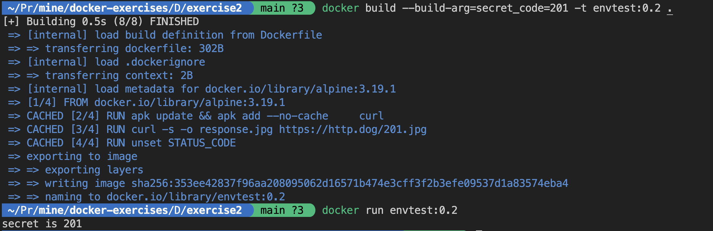
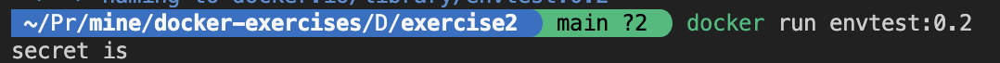

# Docker Exercise: Proper Handling of Environment Variables

You are provided with the following Dockerfile:
```Dockerfile
FROM alpine:3.19.1

ARG secret_code

ENV STATUS_CODE=${secret_code} 

RUN apk update && apk add --no-cache \
    curl

RUN curl -s -o response.jpg https://http.dog/${STATUS_CODE}.jpg

RUN unset STATUS_CODE

CMD [ "sh", "-c","echo secret is ${STATUS_CODE}" ]
```

- It accepts a `secret_code` as a build argument, this argument will be set as an environment variable
- It downloads an image using the environment variable value, 
- It unsets the environment variable. 

However, there is an issue with the Dockerfile. Even after unsetting the environment variable using `unset STATUS_CODE`, the container still prints the environment variable value as shown in below screenshot. Your task is to fix this issue while still making use of the environment variable.



## Instructions:

1. Change the directory to `Dockerfile-exercises/exercise2/`

2. Build the Docker image using the following command:

```shell
docker build --build-arg=secret_code=201 -t envtest:0.2 .
```

3. Once the image is built, run the container using the following command:
```shell
docker run envtest:0.2
```

## Expected Outcome:
When you run the container, it shouldn't print the secret value.

