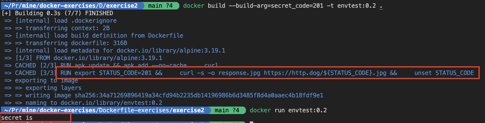

# Docker Exercise Solution: Proper Handling of Environment Variables

In the provided Dockerfile:
```Dockerfile
FROM alpine:3.19.1

ARG secret_code

ENV STATUS_CODE=${secret_code} 

RUN apk update && apk add --no-cache \
    curl

RUN curl -s -o response.jpg https://http.dog/${STATUS_CODE}.jpg

RUN unset STATUS_CODE

CMD [ "sh", "-c","echo secret is ${STATUS_CODE}" ]
```

The issue here is each `ENV` line creates a new intermediate layer, just like `RUN` commands. This means that even if you unset the environment variable in a future layer, it still persists in this layer and its value can be dumped.<br><br>
To prevent this, and really unset the environment variable,we can use `RUN` command with shell commands, to set, use, and unset the variable all in a single layer. You can find more details [here](https://docs.docker.com/develop/develop-images/instructions/#env).

## Proposed Solution:

```Dockerfile
FROM alpine:3.19.1

ARG secret_code

RUN apk update && apk add --no-cache \
    curl

RUN export STATUS_CODE=${secret_code} && \
    curl -s -o response.jpg https://http.dog/${STATUS_CODE}.jpg && \
    unset STATUS_CODE

CMD [ "sh", "-c","echo secret is ${STATUS_CODE}" ]
```
This solution ensures that setting, using, and unsetting the environment variable all occur within the same layer, preventing its exposure to future layers.

## Expected Outcome:
The Dockerfile solution provided ensures a single layer for setting, using, and unsetting the environment variable, preventing its persistence in subsequent layers. This approach enhances security by avoiding exposure of sensitive environment variables.


