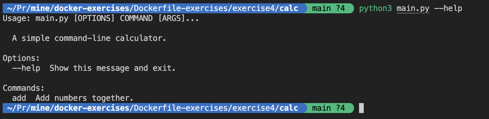

## Local Setup
Follow these steps to set up the application locally:

1. Create a virtual environment to install application dependencies:
```shell
python3 -m venv .venv 
```
2. Activate the virtual environment:
```shell
source .venv/bin/activate  
```
4. Install dependencies
```shell
pip3 install -r requirements.txt 
```

You can now run the application
```shell
python3 main.py --help
```

