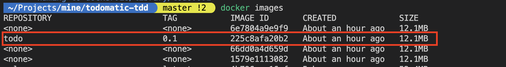
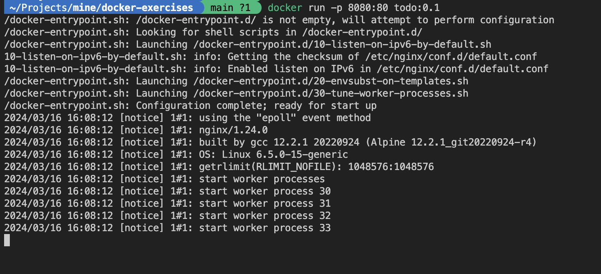
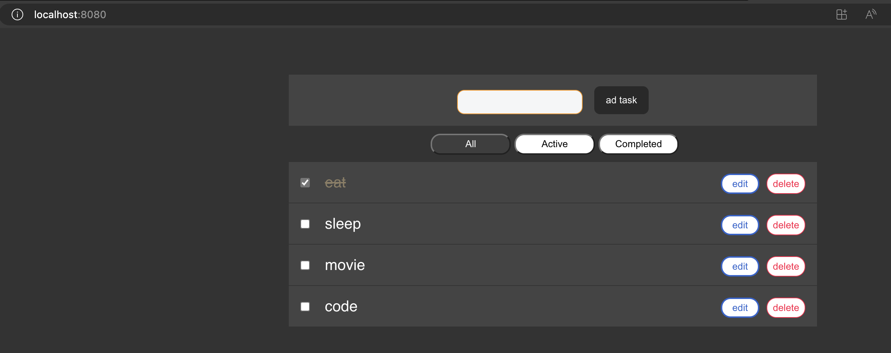

# Excercise5: Containerizing React application

## Background:
One of our clients is developing a next-generation todo application. They've created version 1 of the application but encountered issues when containerizing it as the resulting image size was too large. They seek to optimize the image size using multi-stage builds. They are also looking to deploy the application using nginx.

Clone the repo `https://github.com/venkyvajrala/todomatic-tdd`

## Requirements:

- Improve docker image size < 13MB
- Deploy the application to nginx container


## Expected outcome:

After completing the exercise, the Docker image should be listed as follows:
```shell
docker images
```



The application should be accessible on `localhost:8080` after running the following command:
```shell
docker run -p 8080:80 todo:0.1 
```



