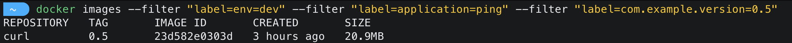
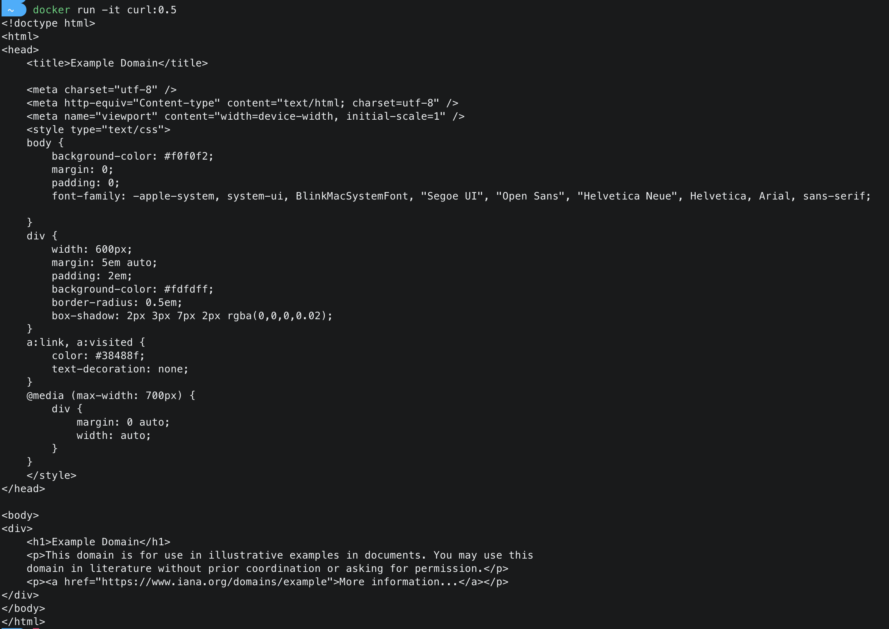

# Exercise 1: 

Create image using `alpine:3.19.1` , label the image as `env=dev` `application=ping` `version=com.example.version=0.5` , Install the packages `curl`, `git`, `ping` and it should print curl output of `www.example.com`

After the image is built below command should output your image in terminal

```shell
docker images --filter "label=env=dev" --filter "label=application=ping" --filter "label=com.example.version=0.5"
```



If we run the container , it should print output similar to below
```shell
docker run -it curl:0.5
```

