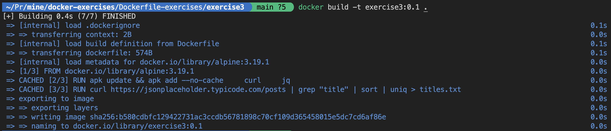
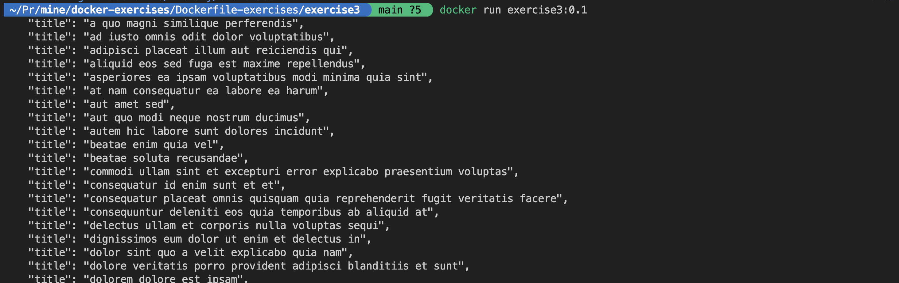
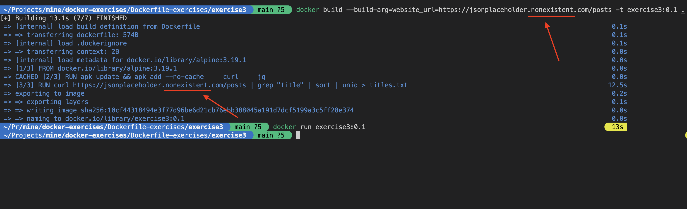
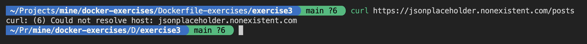

# Excercise3:
You're given the following Dockerfile:
```Dockerfile
FROM alpine:3.19.1

RUN apk update && apk add --no-cache \
    curl \
    jq

ARG website_url="https://jsonplaceholder.typicode.com/posts"

RUN curl ${website_url} | grep "title" | sort | uniq > titles.txt

CMD [ "sh","-c","cat titles.txt" ]


```
You tried building the image as shown below and we could see that build is succesful


You then tried running the image built and it succesfully printed out the titles it generated.


However, when you provided a dummy URL as a build argument to test the build process, the build did not fail as expected.
```shell
docker build --build-arg=website_url=https://jsonplaceholder.nonexistent.com/posts -t exercise3:0.1 .
```


You are surprised that build is not failed and succefsully created the image but you wanted the build to fail because the URL you gave is non-existent and you expected an error similar to below


## Task:
Make the build process fail when the URL provided isn't right

## Expected outcome:
- When you run the build without providing any build arguments, it should use the default argument value for the website URL and succeed in building the image.
- When you provide a dummy URL, the build process should fail.