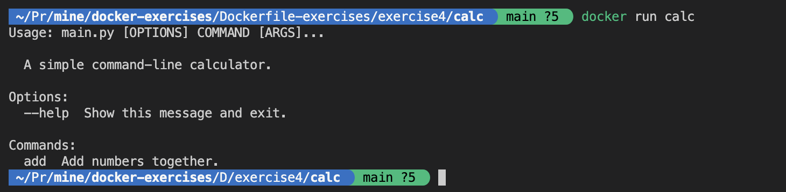

# Excercise 4 Containerizing python application

In this exercise, you will assist a client in containerizing their Python application.

## Application Setup
The application code is located inside the `exercise4/calc` directory. Follow the instructions in [calc/setup.md](./calc/SETUP.md) to set up the application on your local system.

## Requirements:

- It should accepts `python_version` ,`user`, `user_id` as build arguments
- It should make use of python_version to select base with tag `python_version`.
- It should create non root user and group with given `user` and `user_id`
- `group_id`, `group_name` should be equal to `user_id` and `user_name` respectively
- Set working directory as `/home/<user_name>/src/app`

## Expected output:

### Building the Application

#### You should be able to build the application using below command
```shell
docker build --build-arg=python_version=alpine3.18 -t calc:latest .  
```

### Running the Container

#### When running the container without any arguments, it should print the following output:
```shell
docker run calc 
```


#### The container application should print the following output with arguments:
```shell
docker run calc add --help
docker run calc add  1 1 2 3 5 8 13 21 
```

