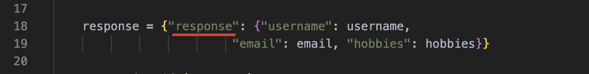

# Compose exercise1 - Watch
## Background:
You've recently joined a new project, and one of the initial tasks involves simplifying the development process for a Python Flask web application.

Please refer to `compose/exercise1/app/SETUP.md` for local setup instructions.

## Requirements:
Your task is to update the Docker Compose file located at `app/compose.yml` to meet the following requirements:

- Containers should automatically rebuild when changes are made to the  `requirements.txt` file.
- Changes made to the `app.py` file should reflect in the container without requiring a container restart.
- Utilize Docker Compose to start all the services.
- Do not modify the app/Dockerfile.

## Expected outcome:

### 1. Testing Changes in app.py:

Modify the response in `compose/exercise1/app/app.py` as described below:



Docker Compose watch should detect the change and synchronize the app code into the container.


After the synchronization, the application output should reflect the new changes. You can verify this by running:
```shell
curl http://localhost:8080
```


### 2. Testing Changes in requirements.txt: 
Add a new package to `compose/exercise1/app/requirements.txt` file as illustrated below:


Docker Compose watch should detect the change and rebuild the container due to the package modification.


After the rebuild, the application should be accessible. You can verify this by running:
```shell
curl http://localhost:8080
```
