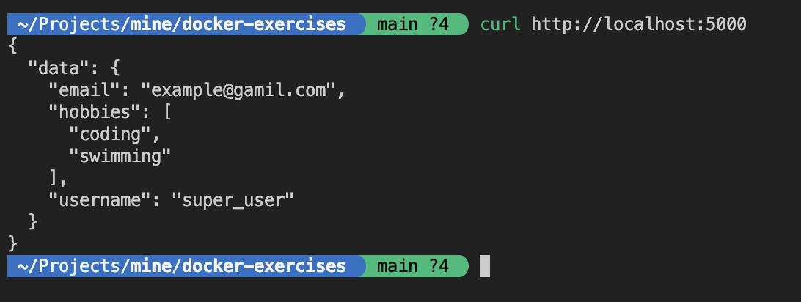

## Local Setup

Follow these steps to set up the application locally:

1. Create a virtual environment to install application dependencies:

```shell
python3 -m venv .venv
```

2. Activate the virtual environment:

```shell
source .venv/bin/activate
```

4. Install dependencies

```shell
pip3 install -r requirements.txt
```

You can now run the application.
This command runs application in debug mode which supports hot reloading

```shell
FLASK_DEBUG=true flask run
```

Note: You can deactivate virtual env using `deactivate` command



