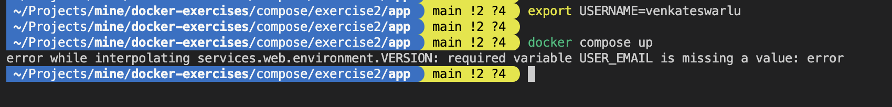

# Compose exercise2 - ENV

## Background:
As part of your involvement in a new project, one of the initial tasks is to implement validation for environment variables.

Please refer to `compose/exercise2/app/SETUP.md` for local setup instructions.

## Requirements:
Your task is to update the Docker Compose file located at `app/compose.yml` to meet the following requirements:

- Docker compose should throw error when `USERNAME` or `USER_EMAIL` environment variables are not set
- If the `TAG` environment variable is not set, Docker Compose should default to using `latest`.

## Expected outcome:

### 1. Without setting env variable for USERNAME

An error response should be returned, as shown in the image below:


### 2. USERNAME set but USER_EMAIL is not set

An error should be thrown indicating that USER_EMAIL is not set. Execute the following command to set USERNAME:
```shell
export USERNAME=venkateswarlu    
```


### 3. USERNAME and USER_EMAIL is set AND TAG is not set

The container should be created with latest as the default tag value. Execute the following commands to set USERNAME and USER_EMAIL, and then build the container:

```shell
export USERNAME=venkateswarlu 
export USER_EMAIL=example@gmail.com
docker compose up --build
```


Application should return response as below
```shell
curl http://localhost:8080
```


<br>
<br>

<details>
<summary>Hint</summary>
Use Docker compose env variables <a href="https://docs.docker.com/compose/environment-variables/env-file/">interpolation</a>.
</details>
