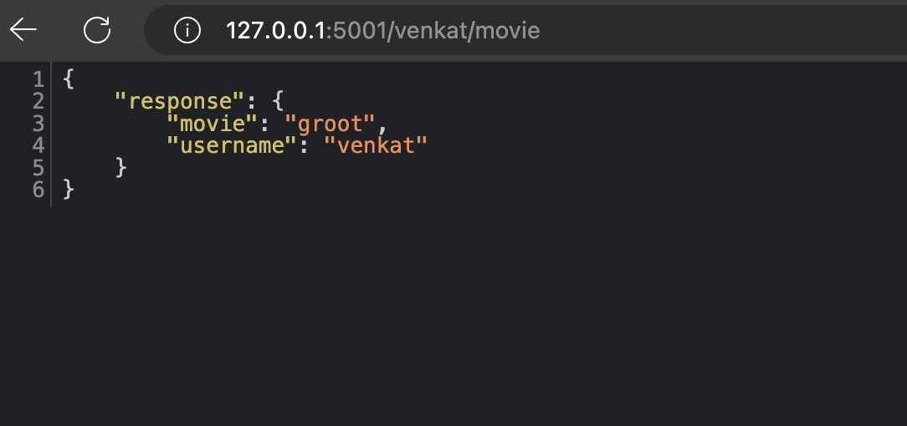
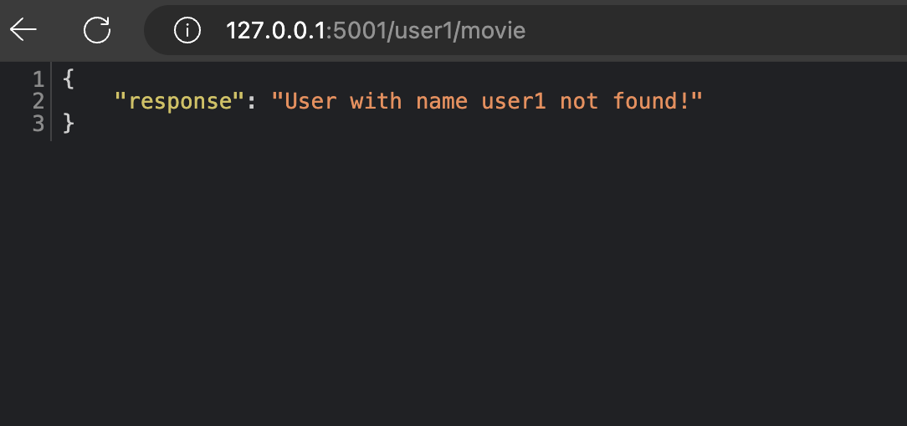

# Docker Compose Exercise 3 - Connecting Containers!

## Introduction:
Welcome to the Docker Compose Exercise 3 - Connecting Containers! This exercise focuses on connecting containers created through Docker Compose to enable communication between applications.

## Background:
A forward-thinking technology company is in the process of containerizing their application stack. They aim to streamline the local setup of services using Docker Compose.

They have developed two applications:

- The first application allows users to input their username and a movie name of their choice, which is then stored in a Redis database.
- The second application retrieves the movie associated with a given username from the Redis database.

## Requirements:
Your task is to configure Docker Compose files to meet the following requirements:

- <b>Do not Modify App1 Directory Files:</b> Ensure that no modifications are made to the files within the app1/ directory.
- <b>Connect App2 to Redis DB:</b> App2 should be able to connect to the Redis database created as part of App1.

## Expected outcome

### 1. 1. App1 Sending Data to Redis DB:

App1 should successfully send data to the Redis database.

### 2. App2 Retrieving Movie Associated with User:

App2 should be able to return the movie associated with the user entered in App1.

### 3. App2 Returning "User Not Found" Response:

App2 should return a "user not found" response when a nonexistent user value is provided.

 

Hint

App2 is not able to connect to Redis DB created by app1 compose config. 
Redis DB will be created in  movie_default network which is created as part of app1 setup.
You need to enable App2 to be able to connect with Redis DB in movie_default network

