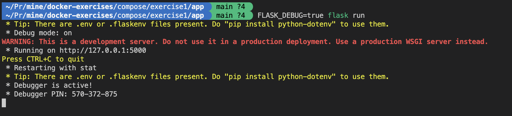
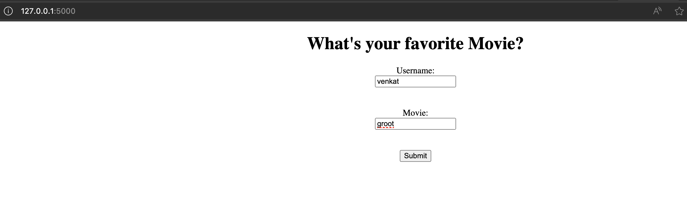

## Local Setup

Follow these steps to set up the application locally:

```shell
docker compose up --build -d  
```



Enter username, movie name and click `Submit`. It will store the details in redis DB.

